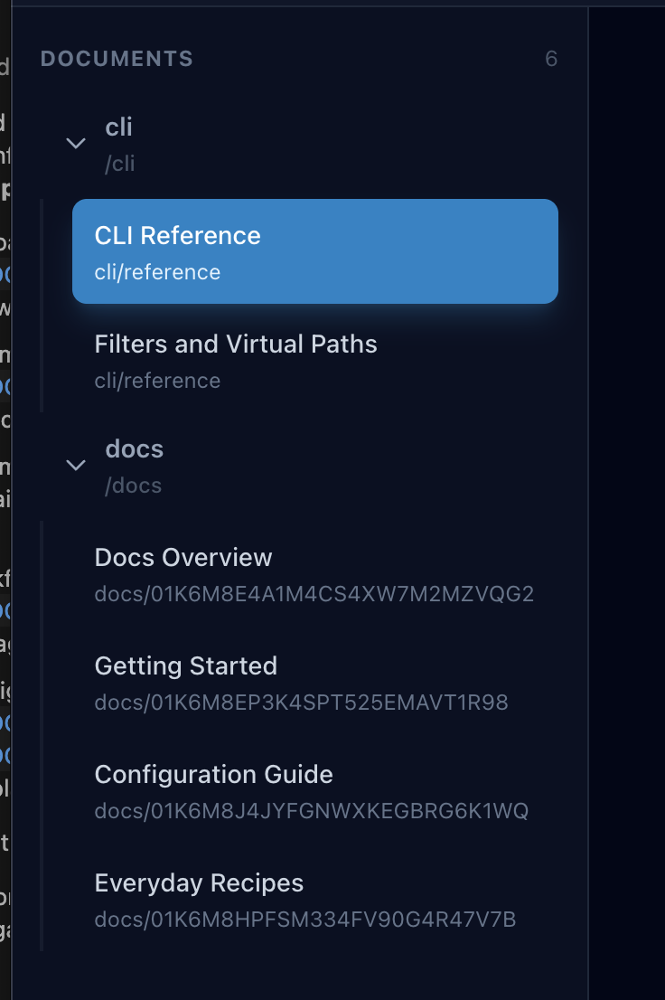

# sort sidebar

## What I need

Current sidebar in viewer is sorted in each folder, but I cannot sort folders
and files as a whole. Also, files in root directory are evaluated as if they
have `./docs` vpath. It make it impossible to organize files as I want.



## So I will create...

1. Implement a dedicated function to build navigation tree from documents. It
   must take two arguments: documents and sort function. sort function may be
   defined in config file, so it will be nice if we use existing logic to apply
   sort function. Add tests for this function.

   The function will have an interface like this:

```ts
function buildNavigationTree(documents: ViewerDocument[], sort: (a: ViewerDocument, b: ViewerDocument) => number): ViewerNavigationDirectory {
    ...
}
```

2. update `viewer` command to use this function.

For example, assume we have these documents in this project:

```bash
% node dist/cli.mjs list --format "{{chapter}}: {{title}} [{{vpath}}]" ./docs

1: Docs Overview [/]
1.1: Getting Started [/]
1.2: Configuration Guide [/]
2: CLI Reference [cli]
2.1: Filters and Virtual Paths [cli]
3: Everyday Recipes [/recipes]
4: Change logs [/]
```

And we have this config:

```bash
% grep -A 12 'docs: defineSchema({' .config/mdf.mts
docs: defineSchema({
    glob: "docs/**",
    schema: z.object({
        title: z.string().min(1),
        description: z.string().optional(),
        vpath: z.string().min(1),
        date: z.iso.date().optional(),
        tags: z.array(z.string()).default(() => []),
        draft: z.boolean().default(false),
        chapter: z.number(),
    }),
sort: (a, b) => a.chapter - b.chapter,
}),
```

In this case, the function will show this sidebar. `CLI` and `recipes` are
folders and they have nested items.

```
Docs Overview
Getting Started
Configuration Guide
CLI
  - Filters and Virtual Paths
  - CLI Reference
recipes
  - Everyday Recipes
Change logs
```
