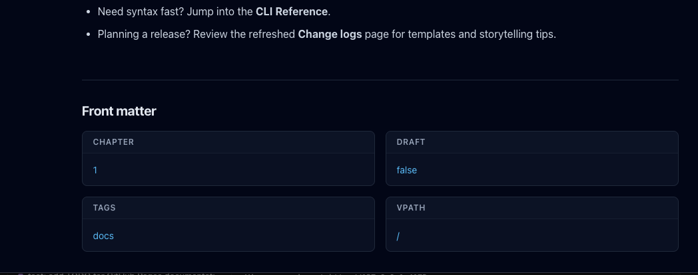

# Update footers and remove `vpath` parameter from viewer

## What I dont need

- we organize docs in sidebar using `vpath` parameter, so it is not needed in
  footer.
- also, it gets broken with export command.

## So I will create...

- update footers and remove `vpath` parameter from pages

## Outcome

- Viewer front matter no longer shows `vpath`, keeping navigation-only metadata
  out of document footers.

  
