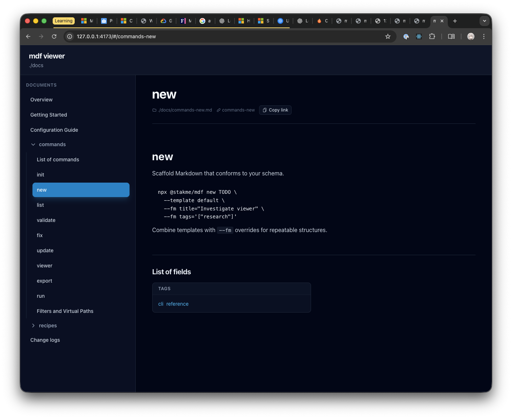

# Update viewer UI

## What I need

- Readable and distinctive style for code blocks
- Remove meaningless subtitle like `./docs` from the header
- Add `Show markdown` button next to the `Copy link` button to show markdown
  source of the page. Also serve assets for this feature.

## So I will create...
