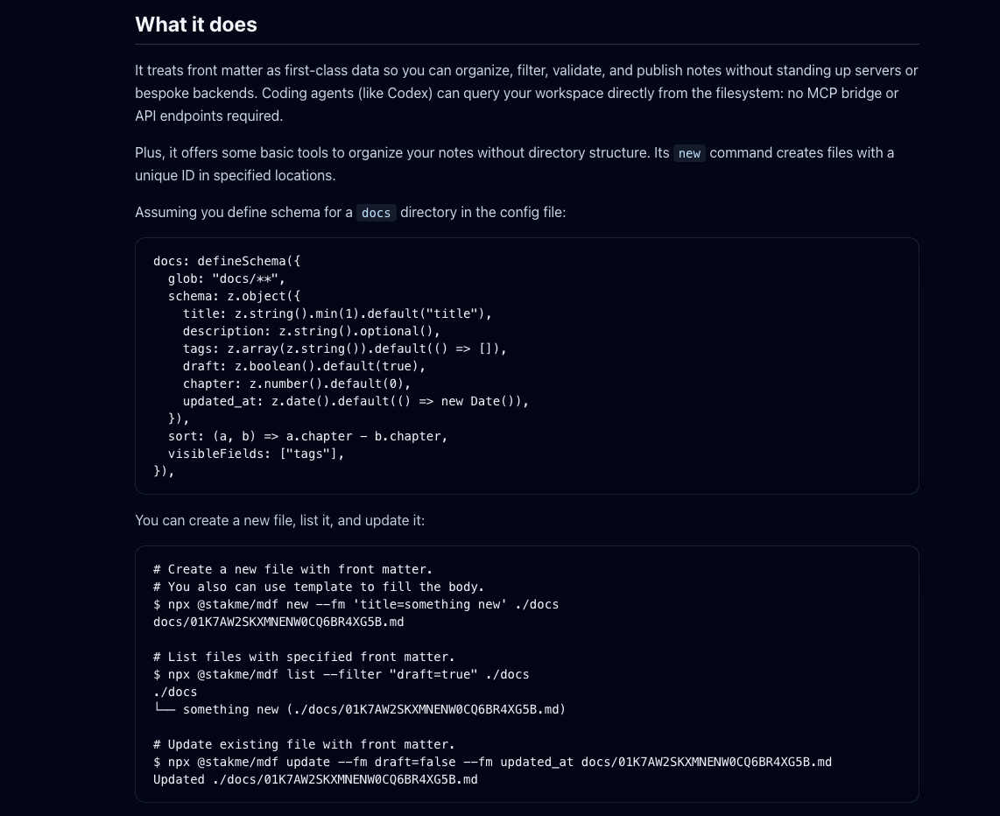

# Introduce code highlighting like GitHub

## What I need

Current viewer app does not support code highlighting. It will be easy to read
code if it is highlighted like GitHub.

## So I will create...

### viewer-app

- [ ] Introduce code highlighting like GitHub
