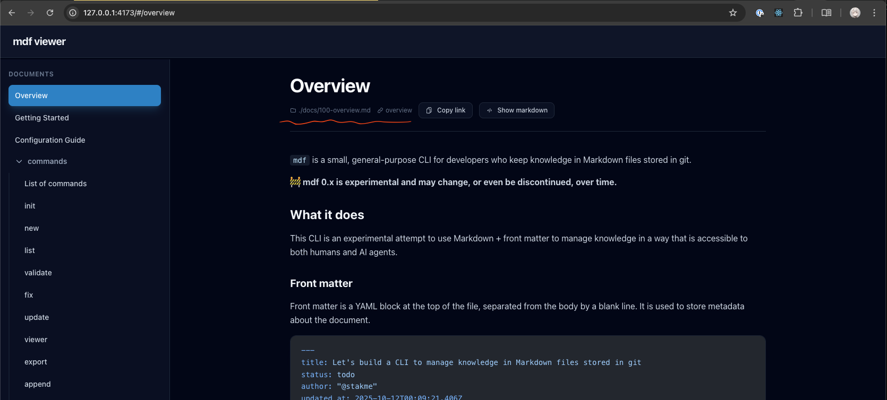

# Update viewer UI

## What I need

Because I expect that users will manage markdown files in git, I want to update
viewer UI to be more git-friendly.

## So I will create...

### .config/mdf.mts

Add `repo` option to its root.

```ts
defineConfig({
    repo: {
        icon: "github", // github or gitlab
        url: "https://github.com/stakme/markdfm/tree/main/",
    },
});
```

### viewer-app

Remove these texts abount file path.



And add a button to open specific file in GitHub or GitLab.
