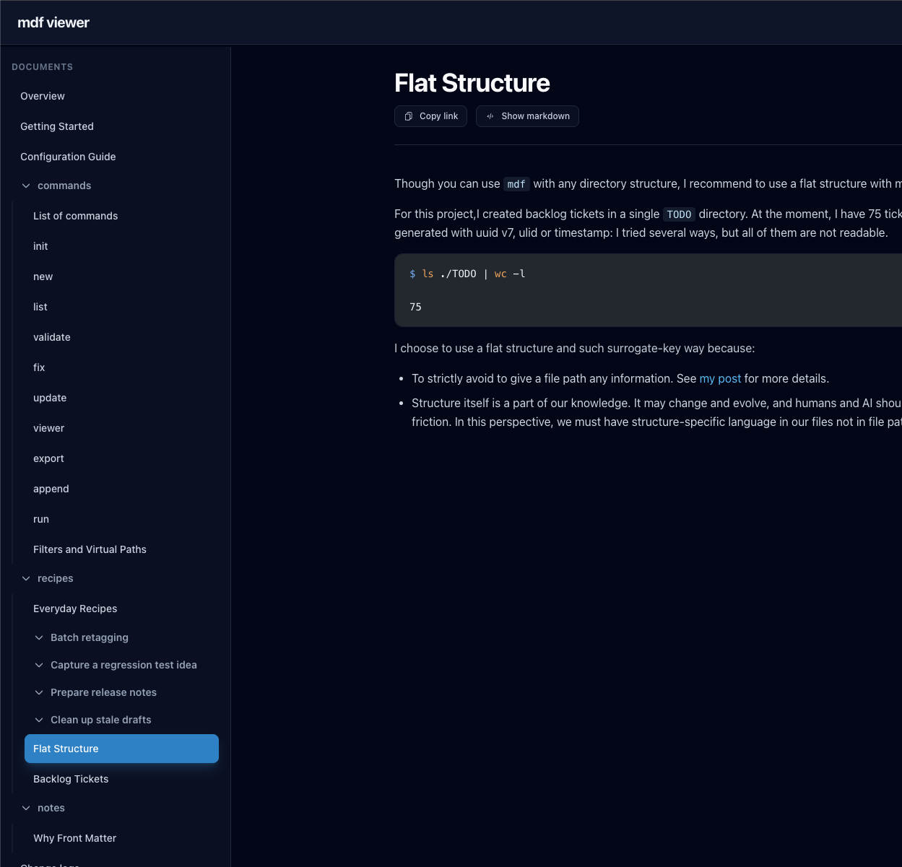

# list command should have the same output like viewer

## What I need

In our viewer, we can see items sorted by sort option.



But `list` command does not have this feature.

```bash
% node dist/cli.mjs list ./docs                         
./docs
├── commands
│   ├── List of commands (./docs/commands-overview.md)
│   ├── init (./docs/commands-init.md)
│   ├── new (./docs/commands-new.md)
│   ├── list (./docs/commands-list.md)
│   ├── validate (./docs/commands-validate.md)
│   ├── fix (./docs/commands-fix.md)
│   ├── update (./docs/commands-update.md)
│   ├── viewer (./docs/commands-viewer.md)
│   ├── export (./docs/commands-export.md)
│   ├── append (./docs/commands-append.md)
│   ├── run (./docs/commands-run.md)
│   └── Filters and Virtual Paths (./docs/commands-filter-vpath.md)
├── notes
│   └── Why Front Matter (./docs/500-why-frontmatter.md)
├── recipes
│   ├── Batch retagging
│   │   └── Batch retagging (./docs/303-recipe-batch-retagging.md)
│   ├── Capture a regression test idea
│   │   └── Capture a regression test idea (./docs/304-recipe-capture-regression-test.md)
│   ├── Clean up stale drafts
│   │   └── Clean up stale drafts (./docs/306-recipe-clean-up-stale-drafts.md)
│   ├── Prepare release notes
│   │   └── Prepare release notes (./docs/305-recipe-prepare-release-notes.md)
│   ├── Everyday Recipes (./docs/300-recipe.md)
│   ├── Flat Structure (./docs/300-flat-structure.md)
│   └── Backlog Tickets (./docs/300-backlog-tickets.md)
├── Overview (./docs/100-overview.md)
├── Getting Started (./docs/101-getting-started.md)
├── Configuration Guide (./docs/102-conf-guide.md)
└── Change logs (./docs/400-changelogs.md)
```

## So I will create...

### list command

```bash
% node dist/cli.mjs list ./docs                         
./docs
├── Overview (./docs/100-overview.md)
├── Getting Started (./docs/101-getting-started.md)
├── Configuration Guide (./docs/102-conf-guide.md)
├── commands
│   ├── List of commands (./docs/commands-overview.md)
│   ├── init (./docs/commands-init.md)
│   ├── new (./docs/commands-new.md)
│   ├── list (./docs/commands-list.md)
│   ├── validate (./docs/commands-validate.md)
│   ├── fix (./docs/commands-fix.md)
│   ├── update (./docs/commands-update.md)
│   ├── viewer (./docs/commands-viewer.md)
│   ├── export (./docs/commands-export.md)
│   ├── append (./docs/commands-append.md)
│   ├── run (./docs/commands-run.md)
│   └── Filters and Virtual Paths (./docs/commands-filter-vpath.md)
├── recipes
│   ├── Batch retagging
│   │   └── Batch retagging (./docs/303-recipe-batch-retagging.md)
│   ├── Capture a regression test idea
│   │   └── Capture a regression test idea (./docs/304-recipe-capture-regression-test.md)
│   ├── Clean up stale drafts
│   │   └── Clean up stale drafts (./docs/306-recipe-clean-up-stale-drafts.md)
│   ├── Prepare release notes
│   │   └── Prepare release notes (./docs/305-recipe-prepare-release-notes.md)
│   ├── Everyday Recipes (./docs/300-recipe.md)
│   ├── Flat Structure (./docs/300-flat-structure.md)
│   └── Backlog Tickets (./docs/300-backlog-tickets.md)
├── notes
│   └── Why Front Matter (./docs/500-why-frontmatter.md)
└── Change logs (./docs/400-changelogs.md)
```
